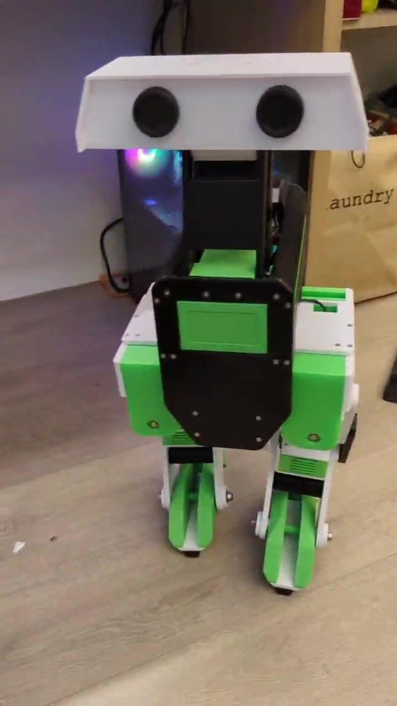

# Low Cost Version for the Star War Droid
## -BOM table
| Item                  | Quantity | Description    | Link |
|-----------------------|----------|---------------|------|
| HTD-85H              | 9        | Servo Position | [HTD-85H](https://e.tb.cn/h.T8ZUWHvCrZehFoB?tk=42w4e1MO2mF)  |
| Servo Control Board  | 1        | Control Board  | [Servo Control Board](https://detail.tmall.com/item.htm?abbucket=13&id=598666101353)  |
| 3D Mesh              | 1        | Model for assembly | [Download](GeDroid-UpdateV3.STEPGeDroid-UpdateV3)  |
| URDF                 | 1        | Robot URDF for training | [Download](./GEDroid-new-URDF/)  |
| Screw Bolt           | 36       | m5-m8                   |  |
| Joystick             | 1        | Default Actions control |  |

## -Assemble guide (coming soon)

## -Control Program
* Joints Validation - {height="100"}
* Walking Validation - {height="100"}
* Default Actions - Burn through Bus Servo Control [ROB](./control/Actions/)

