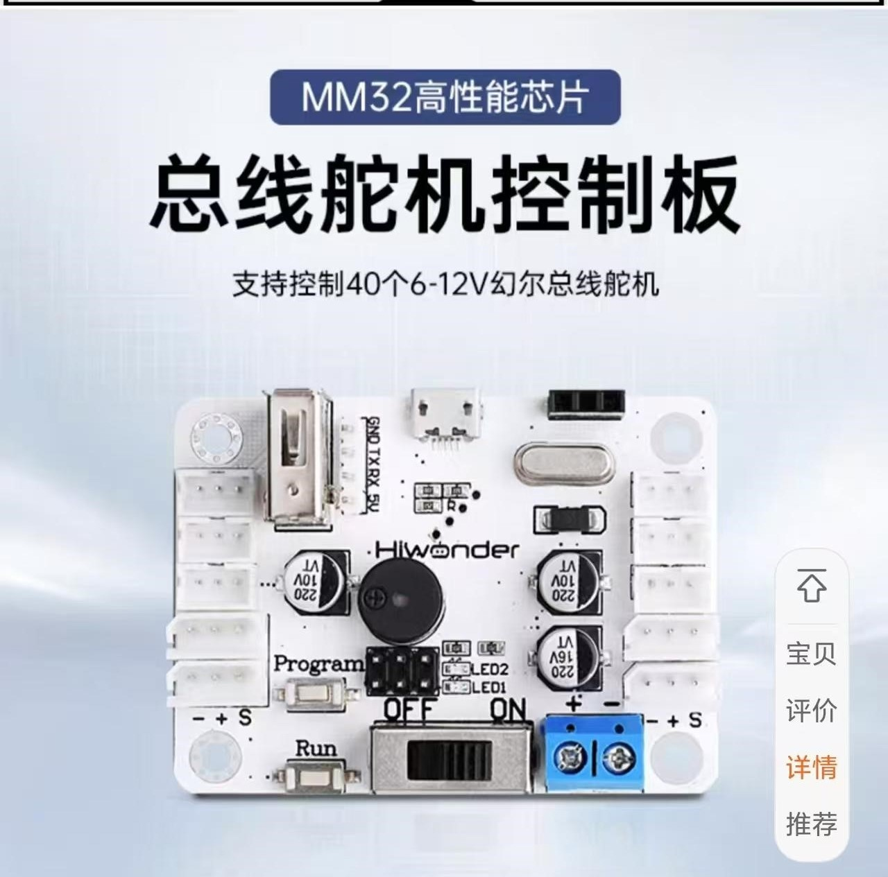

# Low Cost Version for the Star War Droid (James Bruton's repo)
## -BOM table
| Item                 | Quantity | Description               | Link |
|----------------------|----------|---------------------------|------|
| HTD-85H             | 9        | Servo Position            | [HTD-85H](https://e.tb.cn/h.T8ZUWHvCrZehFoB?tk=42w4e1MO2mF)    |
| Servo Control Board | 1        | Control Board             | [Servo Control Board](https://detail.tmall.com/item.htm?abbucket=13&id=598666101353)    |
| 3D Mesh             | 1        | Model for assembly        | [Download](GeDroid-UpdateV3.STEPGeDroid-UpdateV3)    |
| URDF                | 1        | Robot URDF for training   | [Download](./GEDroid-new-URDF/)    |
| Screw Bolt          | 36       | m5-m8                     |  |
| Joystick            | 1        | Default Actions control   |  |

## -Assemble guide (coming soon)
Check original reference [here](https://youtu.be/DoY3duDDiUA?t=153) first 

## -Control Program
* Joints Validation - 
* Walking Validation - 
* Default Actions - <a href="control/Actions/">Burn through ServoBus -ROB  
</a>

