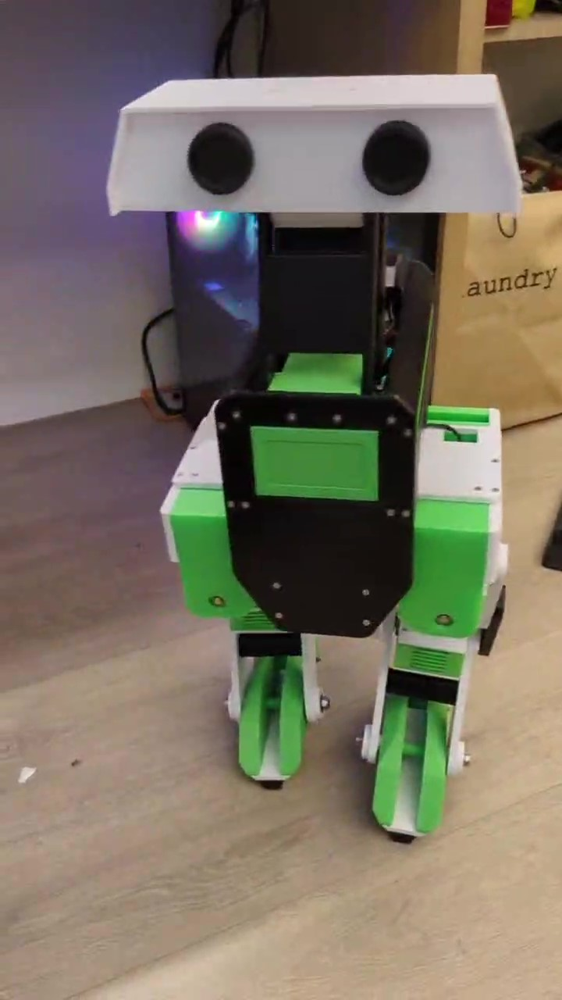

# Interact with GEDroid by Azure services including openai & keyword wakeup

### 1. Install the required package and fill the key values in the .env file
* Test the deepseek R1 by comment out this function -get_deepseek_NIM_response() if you want
### 2. Update the SYSTEM_PROMPT in config.py if needed.
### 3.Implement the robot actions with hiwonder servo API
### 4.Execute -- python client_sample_gedroid.py  , Enjoy the chat with GEDroid robot !
### 5.Demo - 

